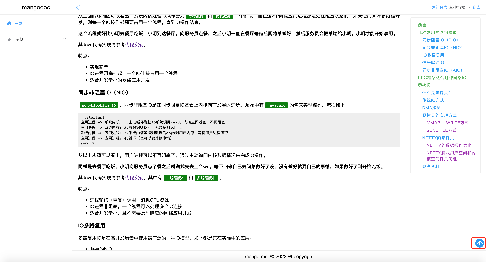

# mangodoc-imgview
mangodoc imgview plugin，集成imgview插件！

[](https://www.npmjs.com/package/mangodoc-imgview)




## Usage
1. Insert script into mangodoc document:

    ```html
    <!-- imgview插件  -->
    <script src="https://cdn.jsdelivr.net/npm/hammerjs@2.0.8/hammer.min.js"></script>
    <link rel="stylesheet" href="https://unpkg.com/mangodoc-imgview@1.0.0/dist/imgview.css">
    <script src="https://unpkg.com/mangodoc-imgview@1.0.0/dist/mangodoc-imgview.min.js"></script>
    ```
